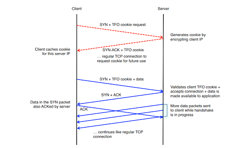
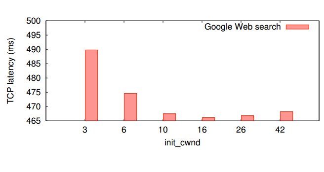
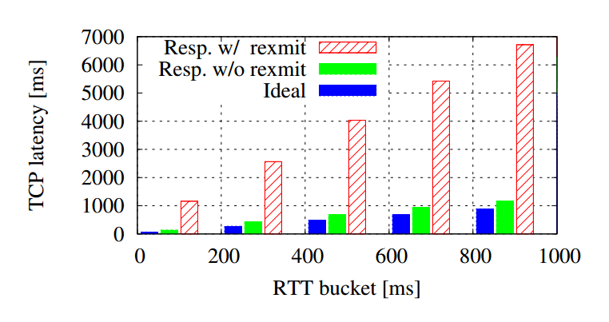

% Making the Web Faster : A Survey
% Pankaj More
% 19th April, 2013

# Introduction

Even though the average web page size is around 300 KB, the average page load time is more than reasonable. More bandwidth does not help. Indeed, most web connections today in US are 5 mbps+. Any increase in bandwidth is going to negligibly improve the page load time. Its actually the number of RTTs that has the most influence on page load time [say @tfo]. It is well known that improving latency leads to higher productivity, more user satisfaction and better user experience overall. More than 51 percent of users will switch to a competitor if the website is slower by 1 second. Moreover, an increase in page load time even by half a second can lead to a significant loss in revenue especially for e-commerce platforms. Hence, there has been a lot of research recently in improving the latency of web applications and specifically in reducing the page load time of web pages.

# Survey

What follows is a short survey on the recent research done primarily in the area of making the web faster. Most of the survey is focused on improvements to existing protocols at the transport and application layer which lead to improvements in latency and page load time.

## Transport Layer Improvements

There has been lot of research around improving the TCP protocol with regards to performance, quality of service, reliability guarantees, etc. In this survey, we will only talk about those approaches which focus on reducing the page load time by proposing changes in the TCP protocol.

### TCP Fast Open

Most of TCP connections used for web services are short lived requests. Due to this, the initial handshake is a considerable bottleneck. Being able to exchange data during TCP's initial handshake procedure can save 1 RTT per request and reduce page load time by up to 40 percent. @tfo talk about a new extension to TCP called TCP Fast Open in which they propose using a "security" cookie to prevent spoofing attacks while data exchange during 3WHS.

The security token is basically an encrypted bytestring of the client's IP address. When the client initiates a tcp connection using the TFO option, the server generates a cookie for the client and sends it with SYN-ACK. The client caches the cookie and uses it to fast open subsequent tcp connections with the same server. Its design is quite simple and the defence against DOS attacks reasonable leads to ease in deployments. In fact, since Linux kernel 3.7 as of November,2012 , TCP Fast Open support has already been added and it is being used in real-world.

### Update CWND from 3 to 10 segments

While the average bandwidth over the world has increased steadily over the last decade, the default value of TCP's initial congestion window has not been changed for a long time. Because most Web transactions are short-lived, the initial congestion window is a critical TCP parameter in determining how quickly flows can finish. @icw36640 proposed to increase TCP’s initial congestion window to at least ten segments (about 15KB). Having disposal to the unprecedented resources at Google, they were able to run large scale internet experiments to quantify the latency benefits and costs of using a larger congestion window size as functions of network bandwidth, round-trip time (RTT), bandwidth delay product (BDP), and nature of applications. They showed that the average latency of HTTP responses improved by approximately 10% with the largest benefits being demonstrated in high RTT and BDP networks. In the longer term, a larger initial congestion window will also mitigate the need for applications to use multiple con-current connections to increase download speed. Based on their paper's strong proposal, default size of CWND has been changed from Linux 2.6.33 on-wards.

For more details on the trade off between small and large window size and the negative impact of large size on re transmission rate, the reader is suggested to look at the original paper. Possible future work suggested is to focus on making the initial congestion window variable to scale to even larger network speeds and web page sizes.

### Proportional Rate Reduction for TCP

Packets losses increases the latency for web users by huge amount especially for clients with high RTT. @ppr37486 explores problems with existing fast recovery algorithms for recovering from packet losses. They found out that the Linux implementation suffers from excessive congestion window reductions whereas RFC3517 is quite aggressive and transmits large bursts under high losses, both of which harm rest of the flow and impact web latency. Their main contribution is the design of a new fast recovery algorithm inspired by rate halving algorithm called PRR. PRR recovers from losses both quickly and smoothly by pacing out the re-transmissions across received ACKs. PRR has been approved as the default Linux fast recovery algorithm starting 3.x.

For short http transactions, fast retransmit is usually not triggered because three dupacks are not received for fast retransmissions. @ppr37486 evaluated the TCP early retransmit algorithm that lowers duplicate acknowledgement threshold for short transfers. Experiments on Google web servers show that native ER exhibits spurious retransmissions due to reordering of packets. On delaying the early retransmissions for a short interval, they found out that the problem of spurious retransmissions could be mitigated.

### Laminar TCP

There are lots of research papers based on different congestion control in TCP protocols. In most of these algorithms, the state variables *cwnd* and *ssthresh* are misused and carry different meaning in different papers. This leads to poor understanding of the algorithm and loosely defined behaviours under a combination of events such as application stalls during loss recovery. Laminar is a new framework for TCP congestion control that separates transmission scheduling, which determines precisely when data is sent, from pure congestion control, which determines the total amount of data sent during each RTT [@tcpLaminar].This new framework will not change the intended behaviour of any of the existing congestion control algorithms. Instead, it will permit new algorithms with better behaviours when multiple congestion control algorithms are invoked concurrently in special cases. It will foster creation of new algorithms to address special problems that are not handled well by today's algorithms. It is expected to enable new advanced algorithms to more precisely regulate TCP traffic.

## TLS False Start and TLS Next Protocol

A full TLS handshake takes two full protocol rounds before the handshake is complete and then the parties may begin to exchange data. Like in case of TCP Fast Open, @tfs suggest an extension to TLS to save 1 RTT for certain handshakes.

Similarly, @tnp proposes a TLS extension for application layer protocol negotiation. This allows the application layer to negotiate which protocol should be performed over the secure connection in a manner which avoids additional round trips and which is independent of the application layer protocols.

## Client Subnet in DNS Requests

Many Authoritative nameservers today return different replies based on the perceived topological location of the user. These servers use    the IP address of the incoming query to identify that location. Since most queries come from intermediate recursive resolvers, the source address is that of the recursive resolver rather than of the query originator.

Traditionally, recursive resolvers were reasonably close in the topological sense to the stub resolvers or forwarders that are the source of queries. For  these resolvers, using their own IP address was sufficient for authority servers that tailor responses based upon location of the query originator.

Increasingly though a class of remote recursive servers has arisen that serves query sources without regard to topology. The motivation for a query source to use a remote recursive server varies but is usually because of some enhanced experience, such as greater cache security or applying policies regarding where users may connect. A similar situation exists within some ISPs where the recursive servers are topologically distant from some edges of the ISP network, resulting in less than optimal replies from the authority servers.

@dns propose an EDNS0 option to convey network information that is relevant to the message. This will provide the mechanism to carry sufficient network information about the originator for the authority server to tailor responses.  It also provides for the authority server to indicate the scope of network addresses that the tailored answer is intended.

## SPDY

One of the problems with HTTP implementations is that HTTP relies on multiple connections for concurrency. This causes several problems, including additional round trips for connection setup, slow-start delays, and connection rationing by the client, where it tries to avoid opening too many connections to any single server. HTTP pipelining helps some, but only achieves partial multiplexing.

@spdy proposes a new protocol called SPDY. SPDY adds a framing layer for multiplexing multiple, concurrent streams across a single TCP connection (or any reliable transport stream). The framing layer is optimized for HTTP-like request-response streams, such that applications which run over HTTP today    can work over SPDY with little or no change on behalf of the web application developer.

The SPDY protocol offers four improvements over HTTP:

i. Multiplexed requests: There is no limit to the number of requests that can be issued concurrently over a single SPDY connection.
ii. Prioritized requests: Clients can request certain resources to be delivered first.  This avoids the problem of congesting the network channel with non-critical resources when a high-priority request is pending.
iii. Compressed headers: Clients today send a significant amount of    redundant data in the form of HTTP headers.  Because a single web page may require 50 or 100 subrequests, this data is significant.
iv. Server pushed streams: Server Push enables content to be pushed from servers to clients without a request.

SPDY attempts to preserve the existing semantics of HTTP. All features such as cookies, ETags, Vary headers, Content-Encoding negotiations, etc work as they do with HTTP; SPDY only replaces the way the data is written to the network.

SPDY achieves 51 percent reduction in amount of bytes uploaded , 4 percent reduction in downloaded bytes and 19 percent reduction in total number of packets as compared to HTTP.

It has been implemented in Chrome and Firefox already. Most popular web servers including apache, nginx, node.js and netty support SPDY transparently. Companies such as Twitter, Facebook, Wordpress, Akamai, etc including Google are already using it. Prospects of it being standardized soon as HTTP 2.0 are looking quite good.

# Conclusion

Even though average bandwidth is going up, latency is not going down. As discussed above, a lot of small incremental improvements combined together can lead to significant improvement in page load time. Scope for improvements at transport layer and application layer are virtually limitless. This survey gives a glimpse of the novel solutions to improve latency.

# References
